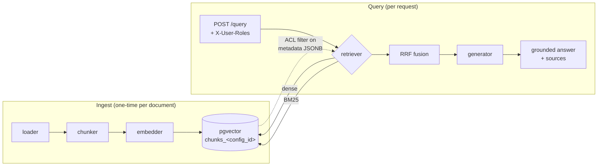

# RAG Evaluation System

A Retrieval-Augmented Generation pipeline built around a first-class evaluation
harness, with role-based access control on retrieval.

The point isn't to demonstrate that RAG *works* — that's a solved tutorial. It's to
demonstrate the part tutorials skip: **measuring whether a change is actually an
improvement**, comparing design choices as controlled experiments, and being honest
about what the data does and doesn't support.

The headline result: a systematic 6-configuration comparison improved retrieval
quality by **+0.17 MRR (+21%)** over the initial baseline while making each query
**41% cheaper** and **19% faster** — and the analysis is equally clear about which of
those gains are statistically demonstrated and which are not.

---

## The core discipline

One rule shaped this project more than any other:

> **Nothing counts as an improvement until the evaluation harness measures it as one.**

That forced an uncomfortable ordering. The evaluation harness was built *before* any
tuning, and the swappable-component layer *before* the experiment matrix — so the
matrix could run by changing configuration alone, with zero pipeline edits. Slower to
start, but it means every claim below has a number behind it, and every number came
from code that was in place before anyone knew what the answer would be.

It also meant accepting results that contradicted expectations. Several did.

---

## Results: the experiment matrix

Three chunking strategies × two embedding models, everything else held constant:
same corpus, same 35-question dataset, same top-K, same generation model, same
prompts. Generation metrics are the mean of 3 runs (LLM-judge scores wobble); IR
metrics are deterministic.

**Quality**

| configuration | P@1 | Recall@5 | MRR | faithful. | ans. rel. | ctx prec. | ctx rec. |
|---|---|---|---|---|---|---|---|
| `recursive-512 × 3-small` *(baseline)* | 0.700 | 0.883 | 0.789 | 0.854 | 0.803 | 0.831 | 0.933 |
| `recursive-256 × 3-small` | 0.567 | 0.850 | 0.700 | 0.837 | 0.772 | 0.792 | 0.900 |
| `semantic × 3-small` | 0.733 | 0.933 | 0.828 | 0.863 | 0.821 | 0.825 | 0.933 |
| `recursive-512 × voyage` | 0.833 | 0.950 | 0.900 | **0.909** | **0.887** | 0.926 | 0.967 |
| `semantic × voyage` | 0.867 | 0.967 | 0.911 | 0.896 | 0.844 | 0.896 | 0.967 |
| **`recursive-256 × voyage`** | **0.900** | **0.967** | **0.925** | 0.901 | 0.841 | **0.929** | 0.967 |
| **↳ + hybrid retrieval** ⭐ | **0.933** | **1.000** | **0.957** | **0.931** | **0.871** | **0.945** | **1.000** |

**Cost and latency**

| configuration | chunks | ingest (one-time) | per query | tokens/query | latency |
|---|---|---|---|---|---|
| `recursive-512 × 3-small` *(baseline)* | 34 | $0.000284 | $0.000369 | 2,403 | 1.310s |
| `recursive-256 × 3-small` | 63 | $0.000282 | $0.000216 | 1,386 | 1.291s |
| `semantic × 3-small` | 31 | $0.000897 | $0.000356 | 2,320 | 1.380s |
| `recursive-512 × voyage` | 34 | $0.001856 | $0.000376 | 2,438 | 1.208s |
| `semantic × voyage` | 31 | $0.002153 | $0.000351 | 2,270 | 1.127s |
| **`recursive-256 × voyage` + hybrid** ⭐ | 63 | $0.001839 | **$0.000217** | 1,378 | **1.058s** |

**Winner: `recursive-256 × voyage-4-large` with hybrid retrieval.** Against the
baseline: **+0.168 MRR (+21%)**, **+0.233 P@1**, **41% cheaper per query**, **19%
faster**. It wins on quality, cost, and latency simultaneously — which was not the
expected outcome. The matrix was designed to *force* a trade-off argument, and there
wasn't one to make.

---

## What the data showed

Four results that changed how the system was built or understood. The full set, with
evidence and confidence levels, is in **[FINDINGS.md](FINDINGS.md)**.

### The cheapest component was the most decisive

Instrumenting cost first produced a clean finding: the embedding model is **~0.2–0.4%
of per-query cost**. It embeds one short question; generation processes ~2,400 tokens
of context. The reasonable inference was that the embedder is not a cost lever.

That inference was right and the conclusion drawn from it was too weak. Averaging
across the matrix, switching embedders was worth **+0.200 P@1 and +0.140 MRR** — about
3× the effect of the chunking axis it was compared against. All three Voyage
configurations beat all three OpenAI configurations on *every* metric, with no overlap.

**The cheapest thing to run was the most expensive thing to get wrong.** Prioritising
tuning effort by "where does the money go" would have pointed at chunk size and top-K,
and away from the variable that actually decided the outcome.

### There is no best chunk size — only a best pairing

The same change, halving chunks from 512 to 256 tokens, applied under each embedder:

| embedder | MRR: 512 → 256 | P@1: 512 → 256 |
|---|---|---|
| text-embedding-3-small | 0.789 → 0.700 = **−0.089** | 0.700 → 0.567 = **−0.133** |
| voyage-4-large | 0.900 → 0.925 = **+0.025** | 0.833 → 0.900 = **+0.067** |

The identical configuration change **degrades one pipeline and improves the other**.
Under 3-small, 256-token chunks are the worst cell in the matrix; under Voyage, the
best. Chunk size has no context-free direction — "use 512" and "smaller chunks
retrieve better" are each empirically wrong for one of the two pipelines here.

This is also an argument against purely sequential tuning: fixing the best chunk size
first, then choosing an embedder, would have locked in 512 under 3-small and never
found the winning cell.

### An easy benchmark measures nothing

The first evaluation dataset had 14 questions, and dense retrieval already ranked a
correct chunk first on 92% of them. On that set, hybrid retrieval looked like a
marginal **+0.021 MRR** — barely worth the extra machinery.

Rebuilding the dataset to 35 questions with a deliberate difficulty spread and an
`exact-term` category, changing nothing else in the code, revealed the same hybrid
implementation was worth **+0.111 MRR** — a five-fold larger effect.

**A weak measured gain can mean the improvement is weak, or that the benchmark can't
see it.** Those are opposite conclusions, and only the score distribution
distinguishes them. The mechanism is not subtle: when 92% of questions are already
answered perfectly, there is no headroom for any method to demonstrate value.

The symmetric case appeared later. Applied to the *winning* configuration, hybrid's
gain shrank to **+0.032 MRR** — 29% of its former size. A strong retriever hides a
technique's value exactly the way an easy benchmark does, for the same reason. So
"hybrid retrieval is worth +0.11 MRR" is meaningless without naming the baseline.

### Retrieval quality propagates into generation quality

Switching the winning configuration to hybrid retrieval raised **faithfulness by
+0.031** and answer relevancy by **+0.030** — against run-to-run noise of 0.003–0.006,
a 5–10× signal-to-noise ratio — with **no change to the generator, the prompt, or the
model**. Only the retrieved context changed.

Recall@5 reached **1.000**: a relevant chunk is now in the top-5 for all 30 answerable
questions, so no remaining failure can be blamed on missing evidence. This is the
clearest confirmation that evaluating the two stages separately pays off — it isolates
which component to fix.

---

## How the winner was chosen — and what it doesn't prove

Six configurations, several quality metrics, three dimensions. Collapsing that into a
ranking requires a value judgement, and the obvious failure mode is choosing weights
*after* seeing which configuration they favour.

**The scoring rule was fixed before the composite was computed** (full reasoning in
[DECISIONS.md](DECISIONS.md) D9):

| component | weight | why |
|---|---|---|
| P@1, Recall@5, MRR | 20% each | Deterministic — zero judge noise — and where the configurable machinery lives |
| faithfulness | 28% | Anti-hallucination: what the system promises |
| answer relevancy | 12% | |

`context_precision` / `context_recall` were **excluded from the score** and reported
as a cross-check instead: both judge *retrieval*, so scoring them in the generation
bucket would have given retrieval ~80% effective weight while the stated rule said
60%. `refusal_accuracy` was excluded because it is 1.000 in every cell — a metric
constant across all candidates cannot change a ranking.

**Three things the analysis is careful about:**

**1. The conclusion survives rejecting the weights.** Sweeping 15 weightings
(retrieval 40–80%, faithfulness 50–90%), the winner holds in **14 of 15**. The
exception flips by 0.0017 — a fifth of the judge noise on a single metric. The defence
isn't that the weights are correct; it's that they don't matter here.

**2. The winner is not statistically separable from the runners-up.** Exact McNemar
tests on paired per-question outcomes:

| comparison | discordant | *p* | 95% CI on ΔP@1 |
|---|---|---|---|
| winner vs baseline | 7 : 1 | 0.070 | [+0.033, +0.367] |
| winner vs `recursive-512 × voyage` | 2 : 0 | 0.500 | [+0.000, +0.167] |
| winner vs `semantic × voyage` | 3 : 2 | 1.000 | [−0.100, +0.167] |

Not one clears *p* < 0.05. Even the +0.233 P@1 gain over the baseline lands at
*p* = 0.070 — "probably real, not demonstrated." **A 30-question benchmark can rank
configurations; it cannot certify the ranking.** Power analysis puts the price of
certainty at ~60–75 questions to separate the winner from the baseline, and ~1,200 to
separate it from the second-best Voyage cell.

**3. The decision is still sound.** Under uncertainty between the top three, the
tie-breakers are the dimensions with *no* sampling error: the winner is the cheapest
per query and the fastest end-to-end. Choosing it costs nothing even if its quality
edge is illusory. And the embedder-level finding is far more robust than any single
pairwise gap — three cells versus three, no overlap on any metric.

---

## Architecture



Every stage is a small, single-purpose module that knows nothing about its neighbours'
internals. Chunkers and embedders are `typing.Protocol` interfaces resolved through a
registry, so a configuration is data:

```python
PRODUCTION = RunConfig(
    chunker="recursive", chunker_params={"chunk_size": 256},
    embedder="voyage",   embedder_params={"model": "voyage-4-large", "dim": 1024},
    retrieval_mode="hybrid",
)
```

**Table-per-configuration storage.** Each `RunConfig` gets its own
`chunks_<config_id>` table, where `config_id` hashes the chunker and embedder
settings. This isn't over-engineering: embedding dimensionality varies between models
(1536 vs 1024), so a single shared table is physically impossible. It also means
matrix cells never contaminate each other.

One detail earned its keep twice: **`retrieval_mode` is deliberately excluded from
`config_id`**, so dense and hybrid read the *same* table. Comparing them cost zero
re-ingestion, and promoting hybrid to production was a one-line change with no data
migration.

**Stack:** Python · FastAPI · PostgreSQL + pgvector · OpenAI & Voyage embeddings ·
gpt-4o-mini generation · RAGAS · rank_bm25 · React + Vite · nginx · Docker Compose ·
GitHub Actions.

---

## Evaluation

Retrieval and generation are scored separately, by deliberately different methods, so
they act as a cross-check rather than a single opinion repeated twice.

**Retrieval — deterministic.** Precision@K, Recall@K, MRR against hand-labelled gold
spans. Relevance is defined by *span containment*, not chunk IDs, so the same labels
work across configurations that chunk the text differently — a prerequisite for the
matrix to be comparable at all. No API calls, no noise, no cost.

**Generation — LLM-as-judge (RAGAS).** Faithfulness, answer relevancy, context
precision, context recall. Because judge scores wobble, every cell runs 3× and reports
mean with min/max spread, so "real difference or noise?" is answerable. Unanswerable
questions are scored separately by refusal accuracy — faithfulness is ill-defined for
"I don't know."

**Dataset:** 35 questions (30 answerable + 5 unanswerable), engineered for difficulty
spread and including an `exact-term` category — specific figures, dates, and Latin
binomials — that exists specifically to make dense-vs-lexical retrieval differences
visible. It is a *benchmark*, tuned to discriminate between configurations, not a
sample of realistic user questions; absolute scores on it are not a claim about
real-world accuracy.

**Cost and latency** are metered from real API usage via a scoped context manager.
Token counts are stored raw, so re-pricing when providers change their rates never
requires re-running anything.

**One measurement caveat worth repeating:** wall-clock latency silently absorbs client
retries. One matrix cell reported 5.26s generation against a true 0.91s because it ran
while an API quota was throttling — while its *quality* metrics were unaffected, since
a retry returns the same answer. Latency from a throttled run is invalid data.

---

## Access control

RBAC filters retrieval by user identity, enforced in the SQL `WHERE` clause on both
the dense and lexical paths — not applied as a post-filter after retrieval, which
would leak through ranking positions and result counts. Documents carry
`allowed_roles` in their `metadata` JSONB; the policy is **default-deny**.

The exit criterion is a **negative test**: a public user must not be able to retrieve
an admin-only passage, with an admin positive control proving the passage is
retrievable at all (so the negative result reflects access control, not a broken
query). It covers both retrieval modes, both configurations the system depends on, and
asserts the *generator* refuses rather than leaking.

```
$ python -m tests.test_rbac
[baseline/dense]    public user correctly DENIED the confidential doc
[baseline/hybrid]   public user correctly DENIED the confidential doc
[production/dense]  public user correctly DENIED the confidential doc
[production/hybrid] public user correctly DENIED the confidential doc
generator did not leak: "I don't know based on the provided context."
RBAC NEGATIVE TEST PASSED (2 configs)
```

Testing *every* configuration, not just the default, was a deliberate fix: each
configuration has its own physical table, and a table the API serves but the test
skips is untested access control.

---

## Running it

**The whole stack, one command:**

```bash
cp .env.example .env        # add OPENAI_API_KEY and VOYAGE_API_KEY
docker compose up -d --build
```

That brings up Postgres+pgvector, the API, and the web interface — the frontend on
**http://localhost:3000**, the API on **:8000**. The browser only ever talks to one
origin: nginx proxies `/api` to the API service, so there is no CORS configuration
anywhere to get wrong.

Then ingest a document and ask something:

```bash
docker compose exec api python -m app.store data/mota-origenes.pdf --config production

curl -s -X POST http://127.0.0.1:3000/api/query \
  -H "Content-Type: application/json" \
  -d '{"question":"Where was Cannabis sativa first domesticated?","k":5}'
```

To see access control working, ingest the admin-only document and ask the same
question as each role — public gets a refusal, admin gets the answer:

```bash
docker compose exec api python -m app.store data/confidential.md --config production --roles admin
curl ... -H "X-User-Roles: admin"   # or omit the header for public
```

> Remove that document again before running the evaluation harness — the harness
> queries unrestricted (it is a trusted internal caller), so an admin-only document in
> the corpus would contaminate the metrics.

**For development** (hot reload, and the venvs the eval harness needs):

```bash
# Two virtualenvs: RAGAS pins an incompatible LangChain line, so eval deps are isolated
python3 -m venv .venv       && .venv/bin/python      -m pip install -r requirements.txt
python3 -m venv .venv-eval  && .venv-eval/bin/python -m pip install -r requirements-eval.txt

.venv/bin/uvicorn app.main:app --reload      # API on :8000
cd frontend && npm install && npm run dev    # Vite on :5173, proxying to :8000
```

**Tests and evaluation:**

```bash
.venv/bin/python -m pytest tests/test_units.py    # 36 tests, no API or DB, ~0.5s
.venv/bin/python -m tests.test_rbac               # RBAC negative test (needs API + DB)

.venv/bin/python      -m eval.retrieval_metrics --config production   # IR metrics
.venv-eval/bin/python -m eval.generation_metrics --config production  # RAGAS judge (billed)
.venv-eval/bin/python -m eval.matrix                                  # the full 6-cell matrix
```

The matrix writes each cell to disk as it completes and reuses saved cells on
re-invocation — a crash or an exhausted API quota costs at most the current cell.
That resilience was added after a 4-hour run died on the last cell and saved nothing.

---

## Status

**Built and measured (Phases 1–6):** the end-to-end pipeline, the evaluation harness
(IR + LLM-judge + cost/latency), swappable chunkers and embedders, hybrid retrieval,
RBAC with a passing negative test, the full experiment matrix with the analysis above,
a React interface with a role switch, full containerization, and CI.

**Where CI deviates from plan.** The roadmap asked for the evaluation suite to run on
every push, failing the build on regression. It doesn't, deliberately
([DECISIONS.md](DECISIONS.md) D11):

- **Every push** runs lint, 36 unit tests, and a Docker build of both images — no API
  key, no database, ~seconds. This works on pull requests from forks, where repository
  secrets are unavailable by design.
- **Evaluation runs on demand**, against the *served* configuration, and **reports
  without failing**. A full generation run is ~350 API requests and exhausted
  the daily quota twice during Phase 5; a gate that goes red from a rate limit rather
  than a code change teaches people to ignore the gate. And a numeric threshold would
  be dishonest at this sample size — F6 shows good configurations aren't statistically
  separable here, so a floor would mostly encode noise.

A weekly scheduled run was written and then deliberately removed: GitHub disables
scheduled workflows in public repos after ~60 days of commit inactivity — the normal
resting state of a finished project — so it would have switched itself off exactly when
it started to matter, after quietly billing for reports nobody read.

The cost is real and worth stating: a quality regression can reach `main` and is caught
only when someone triggers the evaluation by hand.

**Deliberately out of scope:** reranking as a second retrieval stage, contextual/late
chunking, multi-tenancy, and continuous evaluation on live query logs.

**Scale honesty:** one corpus, one domain, 63 chunks, 35 questions. Conclusions are
supported *for this corpus*; whether they generalise to another domain is a question
no number of questions from a single document can answer. BM25 rebuilds its index per
query — correct at this size, the first thing to cache at a larger one — and there is
no vector index, because a brute-force scan is genuinely the right choice at 63 rows.

---

## Documentation

Four companion documents, each answering a different question:

| document | question it answers |
|---|---|
| **[ROADMAP.md](ROADMAP.md)** | What is being built, in what order, and what's off the critical path |
| **[DECISIONS.md](DECISIONS.md)** | Why each choice was made, what was rejected, and what it cost (D1–D10) |
| **[CONCEPTS.md](CONCEPTS.md)** | How each component works, in plain language |
| **[FINDINGS.md](FINDINGS.md)** | What the measurements actually showed — including results that contradicted expectations (F1–F7) |
| **[CLAUDE.md](CLAUDE.md)** | Working notes for anyone (or any agent) picking the repo up: commands, gotchas, and the evaluation discipline learned the hard way |

The split is intentional. Decisions and findings are different kinds of claim: one is
a judgement that can be disagreed with, the other is evidence that can be checked.
Findings record their own confidence level and say plainly when a prediction failed —
including cases where a stated expectation was contradicted by the data and the
document was corrected rather than quietly reworded.
